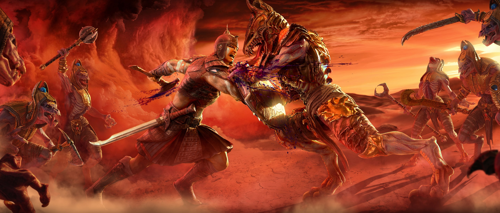
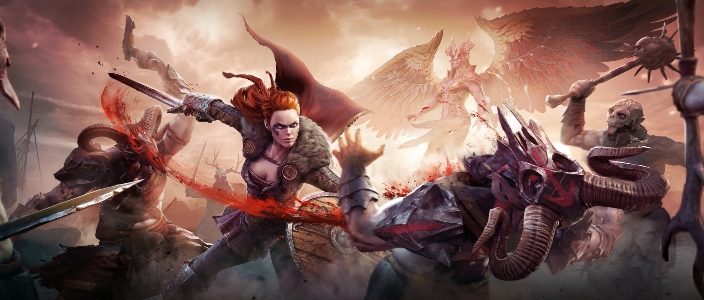
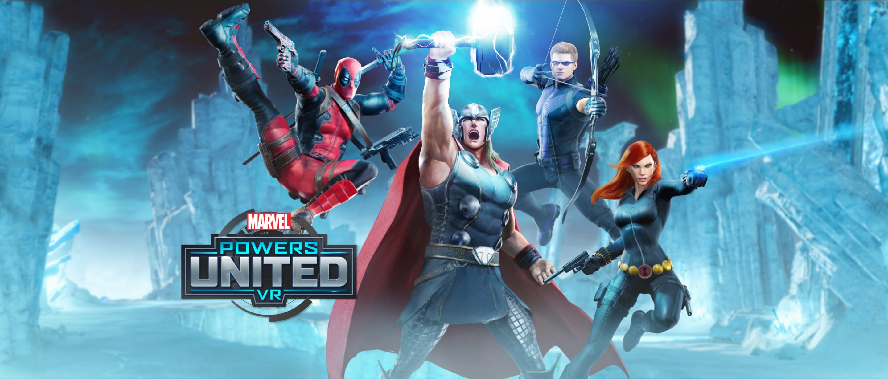
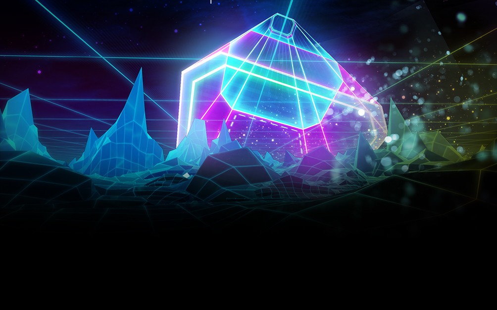

# Austin Rife

Senior Software Engineer

Systems architecture, performance, and the foundational work that makes scale possible.

  Rust
  C++
  HLSL
  Vulkan
  Unreal Engine

## What I Do

---

I build the systems that other systems depend on. My work lives at the intersection of performance engineering and developer experience—creating tools and architectures that are fast, correct, and pleasant to work with.

Most of my professional work has been in games and VR, shipping titles at Meta through Sanzaru Games. Outside of work, I've spent over seven years building a personal game engine as a platform for deep systems exploration.

I'm drawn to problems that reward careful thinking: compilers, graphics pipelines, data-oriented design, and the kind of foundational work that quietly makes everything else possible.

## Portfolio

---

2023

### [Asgard's Wrath 2](https://www.meta.com/experiences/asgards-wrath-2/2603836099654226/)

Shipped 2023 at Meta. Contributed Blueprint VM optimizations (~50% execution time reduction), spatial partitioning systems, cinematic authoring tools, and the save system.

#### Contributions

- **Blueprint VM Optimization** — Profiled and optimized Unreal's Blueprint virtual machine, achieving ~50% reduction in execution time for gameplay scripts
- **Spatial Partitioning** — Implemented hierarchical spatial data structures for efficient world queries and streaming
- **Cinematic Tools** — Built authoring tools for in-game cinematics, enabling designers to create complex sequences
- **Save System** — Designed and implemented the game's save/load architecture handling complex world state

#### Context

60+ hour action RPG for Meta Quest. One of the largest and most ambitious VR titles to date, pushing the boundaries of what's possible on standalone hardware.

<button class="card-close">&times;</button>

2019

### [Asgard's Wrath](https://www.meta.com/experiences/pcvr/asgards-wrath/1180401875303371/)

Shipped 2019 at Meta. Part of the engineering team building core gameplay systems for this action RPG.

#### Contributions

- Core gameplay systems engineering
- Combat and interaction systems
- Performance optimization for VR

#### Context

Award-winning VR action RPG that set a new standard for depth and polish in VR gaming. Built for Oculus Rift, later updated for Quest 2 via Air Link.

<button class="card-close">&times;</button>

2018

### [Marvel Powers United VR](https://www.marvel.com/games/marvel-powers-united-vr)

Shipped 2018 at Meta. Contributed to this cooperative multiplayer VR experience featuring Marvel's iconic heroes.

#### Contributions

- Multiplayer gameplay systems
- Character ability implementation
- VR interaction design

#### Context

Cooperative VR brawler letting players embody Marvel superheroes. 4-player online co-op with a roster of iconic characters each with unique powers and playstyles.

<button class="card-close">&times;</button>

2016

### [Cyberpong](https://store.steampowered.com/app/462000/Cyberpong/)

Shipped 2016 at Colopl. Implemented networked AI players and configured VR arcade deployment for this futuristic pong game.

#### Contributions

- **Networked AI** — Implemented AI opponents that could seamlessly join networked matches
- **VR Arcade Deployment** — Configured and deployed builds for VR arcade installations

#### Context

Futuristic VR pong game designed for arcade and home VR. One of my first shipped VR titles, developed during the early days of consumer VR.

<button class="card-close">&times;</button>

Ongoing

### Eden

A personal game engine built for applied research and deep systems exploration. Seven years of active development across rendering, ECS, asset pipelines, and tooling.

#### Highlights

- **Custom ECS** — Data-oriented entity component system with compile-time archetype queries
- **Vulkan Renderer** — Modern rendering architecture with bindless resources and GPU-driven culling
- **Asset Pipeline** — Hot-reloading asset system with dependency tracking and incremental builds
- **EFX Shader Language** — Custom shading language transpiling to HLSL/SPIR-V with effect composition

#### Technical Focus

Built from scratch in Rust with deep dives into memory allocation, job systems, and GPU programming. The engine serves as a testbed for exploring systems programming concepts at a level commercial engines often abstract away.

<button class="card-close">&times;</button>

## Contact

---

Interested in working together? Feel free to reach out.

[:fontawesome-solid-envelope: Email](mailto:contact@techgeek1.dev){ .contact-link }
[:fontawesome-brands-linkedin: LinkedIn](https://linkedin.com/in/austin-rife){ .contact-link }
[:fontawesome-brands-github: GitHub](https://github.com/techgeek1){ .contact-link }

Currently exploring opportunities in game engine development, simulation technology, and systems programming.

